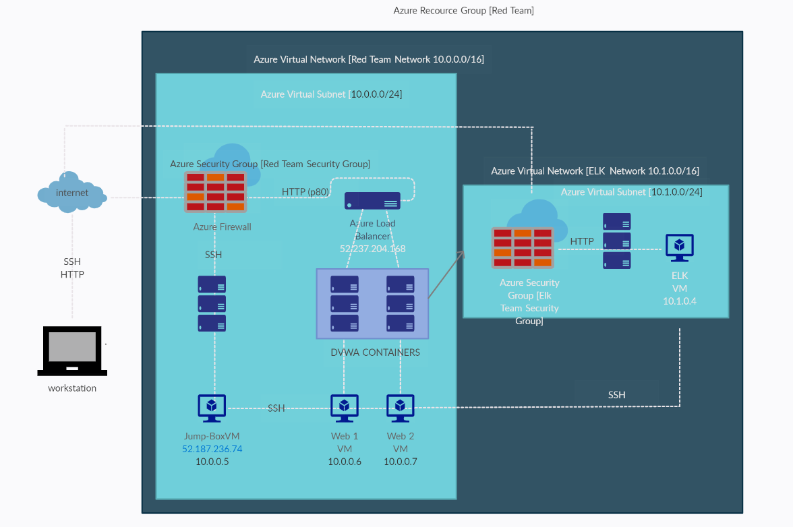
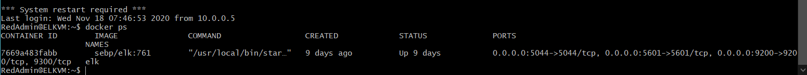

## Automated ELK Stack Deployment

The files in this repository were used to configure the network depicted below.

These files have been tested and used to generate a live ELK deployment on Azure. They can be used to either recreate the entire deployment pictured above. Alternatively, select portions of the filebeat-config.myl file may be used to install only certain pieces of it, such as Filebeat.

This document contains the following details:
- Description of the Topologu
- Access Policies
- ELK Configuration
  - Beats in Use
  - Machines Being Monitored
- How to Use the Ansible Build

### Description of the Topology

The main purpose of this network is to expose a load-balanced and monitored instance of DVWA, the D*mn Vulnerable Web Application.

Load balancing ensures that the application will be highly efficient with load evenly distributed across backend recsources and/or servers, in addition to restricting traffic to the network. The load 
balancer protects websites via the Web Application Firewall (WAF) and can include scheduled rule updates. It may also request to authenticate user access to protect websites against unauthorised access. 
Load Balancers can also detect DDoS attacks by dropping the traffic before it reaches the website. A load balancer can also simplify Payment Card Industry (PCI) compliance with PCI rules. The advatnage 
of a Jump-Box is that it is a secure computer which is used as the first point of contact before any administrative tasks are conducted or as the origin to connect to other servers and untrusted environments. In short, a jump-box is a secure contained node to perform administrative tasks. 

Integrating an ELK server allows users to easily monitor the vulnerable VMs for changes to the _____ and system _____.
- Filebeat watches out for the log files or locations that a user specifies, collects log events, and forwards them either to Elasticsearch or Logstash for indexing.
- Metricbeat takes the metrics and statistics that it collects and forwards them to a specified output such as Elasticsearch or Logstash.

The configuration details of each machine may be found below.
_Note: Use the [Markdown Table Generator](http://www.tablesgenerator.com/markdown_tables) to add/remove values from the table_.

| Name     | Function | IP Address | Operating System |
|----------|----------|------------|------------------|
| Jump Box | Gateway  | 10.0.0.5   | Linux            |
| Web1     | Server   | 10.0.0.6   | Linux            |
| Web2     | Server   | 10.0.0.7   | Linux            |
| ELK      | Server   | 10.1.0.4   | Linux            |

### Access Policies

The machines on the internal network are not exposed to the public Internet. 

Only the Jump Box machine can accept connections from the Internet. Access to this machine is only allowed from the following IP addresses:
- _TODO: Add whitelisted IP addressess_
My public home IP address has been whitelisted and has been allowed access: 175.34.147.192

Machines within the network can only be accessed by the network security group "Red Admin SG" .
- Web1 & Web2 VMs allow for access to the ELK VM

A summary of the access policies in place can be found in the table below.

| Jump Box                                | Publicly Accessible            | Allowed IP Addresses |
|-----------------------------------------|--------------------------------|----------------------|
| JumpBox                                 | Yes, an inbound rule can be    |175.34.147.192        |
| Allow p.80 from LB                      | configured to allow specific   |Azure Load Balancer   |
| Allow HTP from home IP p.80             | IPs to SSH into the provisioner|175.34.147.192        |
| SSH from Jump Box p.22                  |                                |10.0.0.5              |
| Allow SSH inbound p.22                  |                                |175.34.147.192        |
| Default Deny All                        |                                |Any                   |
| Allow RDP from ext home IP over p.3389  |                                |175.34.147.192        |
| Allow Vnet Inbound                      |                                |Virtual Network       |
| Allow Azure Load Balancer Inbound       |                                |Azure Load Balancer   |
| Deny All Inbound                        |                                |Any                   |

| Web1                                    | Publicly Accessible           | Allowed IP Addresses |
|-----------------------------------------|-------------------------------|----------------------|
| Web1 					  | No, can only be accessed      |175.34.147.192        |
| Allow p.80 from LB                      | through the JumpBox machine   |Azure Load Balancer   |
| Allow HTP from home IP p.80             | through deployed docker       |175.34.147.192        |
| SSH from Jump Box p.22                  | container                     |10.0.0.5              |
| Allow SSH inbound p.22                  |                               |175.34.147.192        |
| Default Deny All                        |                               |Any                   |
| Allow RDP from ext home IP over p.3389  |                               |175.34.147.192        |
| Allow Vnet Inbound                      |                               |Virtual Network       |
| Allow Azure Load Balancer Inbound       |                               |Azure Load Balancer   |
| Deny All Inbound                        |                               |Any                   |

| Web2                                    | Publicly Accessible           | Allowed IP Addresses |
|-----------------------------------------|-------------------------------|----------------------|
| Web2                                    | As per above                  |175.34.147.192        |
| Allow p.80 from LB                      |                               |Azure Load Balancer   |
| Allow HTP from home IP p.80             |                               |175.34.147.192        |
| SSH from Jump Box p.22                  |                               |10.0.0.5              | 
| Allow SSH inbound p.22                  |                               |175.34.147.192        | 
| Default Deny All                        |                               |Any                   |
| Allow RDP from ext home IP over p.3389  |                               |175.34.147.192        |
| Allow Vnet Inbound                      |                               |Virtual Network       | 
| Allow Azure Load Balancer Inbound       |                               |Azure Load Balancer   |
| Deny All Inbound                        |                               |Any                   |

| ELK                                     | Publicly Accessible           | Allowed IP Addresses |
|-----------------------------------------|-------------------------------|----------------------|
| ELK                                     | No, accessible via ansible    |175.34.147.192        |
| Allow p.80 from LB                      | docker container and SSH      |Azure Load Balancer   |
| Allow HTP from home IP p.80             |                               |175.34.147.192        |
| SSH from Jump Box p.22                  |                               |10.0.0.5              |
| Allow SSH inbound p.22                  |                               |175.34.147.192        |
| Default Deny All                        |                               |Any                   |
| Allow RDP from ext home IP over p.3389  |                               |175.34.147.192        |
| Allow Vnet Inbound                      |                               |Virtual Network       |
| Allow Azure Load Balancer Inbound       |                               |Azure Load Balancer   |
| Deny All Inbound                        |                               |Any                   |

### Elk Configuration

Ansible was used to automate configuration of the ELK machine. No configuration was performed manually, which is advantageous because...
- _TODO: What is the main advantage of automating configuration with Ansible?_
Automating with Ansible saves time and this is achieved through the YAML playbooks which can be written to perform specific automated tasks.

The playbook implements the following tasks: - _TODO: In 3-5 bullets, explain the steps of the ELK installation play. E.g., install Docker; download image; etc._ 
- install Docker through sudo apt install docker.io
- download an image through sudo docker pull "image name"
- after the image is downloaded use docker run command to launch a container and then connect to its command line
The following screenshot displays the result of running `docker ps` after successfully configuring the ELK instance.

### Target Machines & Beats
This ELK server is configured to monitor the following machines:
- _TODO: List the IP addresses of the machines you are monitoring_
- 10.0.0.6 & 10.0.0.7

We have installed the following Beats on these machines:
- _TODO: Specify which Beats you successfully installed_
- filebeats was successfully installed

These Beats allow us to collect the following information from each machine:
- _TODO: In 1-2 sentences, explain what kind of data each beat collects, and provide 1 example of what you expect to see. E.g., `Winlogbeat` collects Windows logs, which we use to track user logon events, etc._
Filebeats
- used to collect and ship log files. 

Packerbeat
- captures network traffic between servers and can be used for app and performance monitorting.

Metricbeat
- collects and ships metrics for various systems and platforms

Winlogbeat
- collects Windows Event logs

Auditbeat
- audits user and process activity no Linux servers and can be used to identify security breaches

Functionbeat
- "serverless" shipper than can be deployed to function to collect and ship data into the ELK Stack.

### Using the Playbook
In order to use the playbook, you will need to have an Ansible control node already configured. Assuming you have such a control node provisioned: 

SSH into the control node and follow the steps below:
- Copy the install-elk.yml file to roles directory.
- Update the ansible.cnfg file to specific the host server as the "elk server". For filebeat installation "webservers" must be specified under hosts.
- Run the playbook, and navigate to   GNU nano 5.3                                                                                     README.md                                                                                      Modified

### Target Machines & Beats
This ELK server is configured to monitor the following machines:
- _TODO: List the IP addresses of the machines you are monitoring_
- 10.0.0.6 & 10.0.0.7

We have installed the following Beats on these machines:
- _TODO: Specify which Beats you successfully installed_
- filebeats was successfully installed

These Beats allow us to collect the following information from each machine:
- _TODO: In 1-2 sentences, explain what kind of data each beat collects, and provide 1 example of what you expect to see. E.g., `Winlogbeat` collects Windows logs, which we use to track user logon events>
Filebeats
- used to collect and ship log files.

Packerbeat
- captures network traffic between servers and can be used for app and performance monitorting.

Metricbeat
- collects and ships metrics for various systems and platforms

Winlogbeat
- collects Windows Event logs

Auditbeat
- audits user and process activity no Linux servers and can be used to identify security breaches

Functionbeat
- "serverless" shipper than can be deployed to function to collect and ship data into the ELK Stack.

### Using the Playbook
In order to use the playbook, you will need to have an Ansible control node already configured. Assuming you have such a control node provisioned:

SSH into the control node and follow the steps below:
- Copy the install-elk.yml file to roles directory.
- Update the ansible.cnfg file to specific the host server as the "elk server". For filebeat installation "webservers" must be specified under hosts.
- Run the playbook, and navigate to http://40.65.181.190:5601/app/kibana to check that the installation worked as expected.

_TODO: Answer the following questions to fill in the blanks:_
- _Which file is the playbook? Where do you copy it?_
- _Which file do you update to make Ansible run the playbook on a specific machine? How do I specify which machine to install the ELK server on versus which to install Filebeat on?_
- _Which URL do you navigate to in order to check that the ELK server is running?

_As a **Bonus**, provide the specific commands the user will need to run to download the playbook, update the files, etc._

^G Help          ^O Write Out     ^W Where Is      ^K Cut           ^T Execute       ^C Location      M-U Undo         M-A Set Mark     M-] To Bracket   M-Q Previous     ^B Back          ^◀ Prev Word
^X Exit          ^R Read File     ^\ Replace       ^U Paste         ^J Justify       ^_ Go To Line    M-E Redo         M-6 Copy         ^Q Where Was     M-W Next         ^F Forward       ^▶ Next Word
to check that the installation worked as expected.

_TODO: Answer the following questions to fill in the blanks:_
- _Which file is the playbook? Where do you copy it?_
- _Which file do you update to make Ansible run the playbook on a specific machine? How do I specify which machine to install the ELK server on versus which to install Filebeat on?_
- _Which URL do you navigate to in order to check that the ELK server is running?

_As a **Bonus**, provide the specific commands the user will need to run to download the playbook, update the files, etc._
